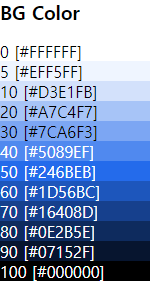
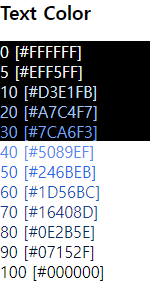

# KRDS_study
디지털 정부서비스 UI/UX 가이드라인 공부

## 참조
- [디지털 정부서비스 UI/UX 가이드라인](https://uiux.egovframe.go.kr/guide/index.html)
- [pretendard-gov](https://github.com/orioncactus/pretendard/tree/main/packages/pretendard-gov)

## 색상
### Primary

